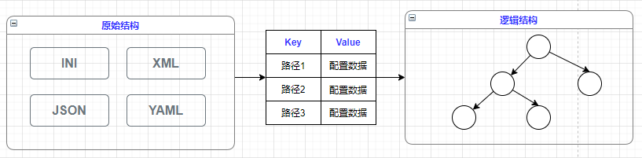

 

>[!WARNING|style: flat|label:  简要说明 ]
>
>[ 配置 + 选项 - 表示两个独立的框架 ]
>
>- [ 配置`Configration`] 通过一致性的编程方式读取配置数据
>
>- [ 选项`Options`] 借助依赖注入框架实现了`Options 模式` [ 将应用的配置 - 直接注入所需的服务中 ]
>
>---
>
>[ 配置系统 - 核心对象 ]
>
>
>
>- `IConfiguration`[ 供客户程序使用 - 读取配置数据 ] [ 配置项：由`键/值对`字符串组成 ]
>- `IConfigurationSource`配置的数据来源(`内存变量, 环境变量, 命令行参数 ... `) 
>
>- `IConfigurationBuilder`主要解决：将不同源提供的数据 → 转换成`IConfiguration`对象
>
>
>---
>
>[ 配置 - 逻辑结构 ]
>
>- (`IConfiguration`) 对象在逻辑上具有一个 [ 树型层次结构 - 称为：配置逻辑树 ]
>
>  [ 原始配置数据：具有多种来源，如内存变量，环境变量，命令行参数等等 ] 
>
> - 配置模型的最终目的：提取原始的配置数据 → 并将其转换成`IConfiguration`对象 [ 配置数据从原始结构 → 转变为逻辑结构 ]
>
>
>
> 
>
>[ 配置由原始结构 → 向逻辑结构的转变 ]
>
>- 原始的配置数据被读取出来后统一转换成 [ 字典：中间结构数据 ]
>
>   一颗配置树通过 [ 叶节点 ] 承载所有的原子配置项 [ 叶节点：由中间字典描述(`Key: 全路径, Value: 配置数据`) ]
>
>
>
>
>
>
>
>
> 

>
>
>- [[👓 NuGet - Microsoft.Extensions.Configuration.Abstractions ]](https://www.nuget.org/packages/Microsoft.Extensions.Configuration.Abstractions/ ':target=_blank') 
>
>   [[👓 NuGet - Microsoft.Extensions.Configuration ]](https://www.nuget.org/packages/Microsoft.Extensions.Configuration/ ':target=_blank')
>
>   
>
>- <a href = 'wwwroot/DocUML/v0.html' target='_blank'>[👓 UML - 设计图 ]</a> [`namespace：Microsoft.Extensions.Configuration`]
>
> 
>
>
>

