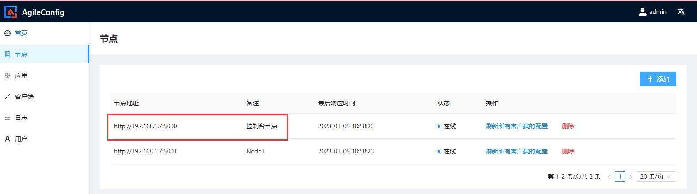
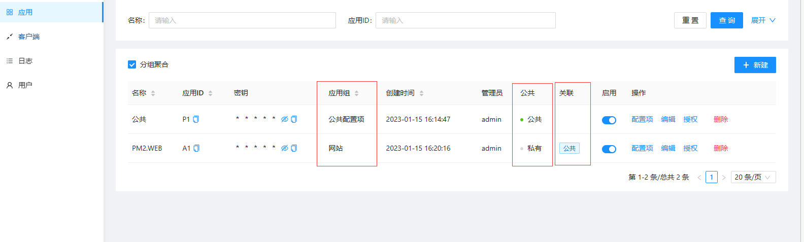

<br/>

>[!WARNING|style: flat|label: 简要说明 ]
>
>- <span style='color:Blue'>[ 初始化数据库 ]</span>用户只需要手工建一个空库(`所有的表 agc_xxx 在第一次启动的时候都会自动生成`)
>
>- 环境变量概述(`-e xxx`)
>
>  | 变量名称       | 变量概述                                                     |
>  | -------------- | ------------------------------------------------------------ |
>  | `TZ`           | 时区(`Asia/Shanghai`)                                        |
>  | `adminConsole` | (`True`)启用控制台功能 <span style='color:Blue'>[ 使该节点同时兼备数据节点 + 控制台管理功能 ]</span> |
>  | `db__provider` | 数据库类型(`sqlserver, mysql, sqlite, PostgreSql, Oracle`)   |
>  | `db__conn `    | 配置数据库连接串                                             |
>
>  <br/>

<!-- tabs:start -->

#### **docker  run**

```shell
docker container run --name Agile_Config \
       -e TZ=Asia/Shanghai \
       -e adminConsole=true \
       -e db__provider=mysql \
       -e db__conn="database=xxxx;data source=xxxx;User Id=root;password=xxxx;port=3306" \
       -p 5000:5000 \
       -itd kklldog/agile_config:latest;
	   

```


#### **docker-compose**

>[!WARNING|style: flat|label: 简要说明 ]
>
>- 建立工作目录(`/usr/local/Agile_Config`)
>
> ```tex
> .
> └── docker-compose.yml
>
>
> ```
>
>---
>
>- 编写部署安装文件(`docker-compose.yml`)
>
>```yaml
>version: '3'
>
>services:
>   Agile_Config_Admin:
>     image: "kklldog/agile_config"
>     ports:
>        - "5000:5000"
>     networks:
>        - PM2Net
>     volumes:
>        - /etc/localtime:/etc/localtime
>     environment:
>        - TZ=Asia/Shanghai
>        - adminConsole=true
>        - cluster=true  #尝试获取容器的 IP [ 主动注册到控制台 - 节点列表 ]
>        - db__provider=mysql
>        - db__conn= database=MyTest;data source=192.168.0.7;User Id=root;password=888888;port=3306
>     restart: always
>
>   Agile_Config_Node1:
>     image: "kklldog/agile_config"
>     ports:
>        - "5001:5000"
>     networks:
>        - PM2Net
>     volumes:
>        - /etc/localtime:/etc/localtime
>     environment:
>        - TZ=Asia/Shanghai
>        - cluster=true
>        - db__provider=mysql
>        - db__conn= database=MyTest;data source=192.168.0.7;User Id=root;password=888888;port=3306
>     depends_on:
>        - Agile_Config_Admin
>     restart: always
>
>networks:
>   PM2Net: ~
>
>
>```
>
>---
>
>- 程序安装
>
>```shell
>#进入工作目录
>[root@localhost ~]# cd /usr/local/Agile_Config; 
>
>#程序安装
>[root@localhost MySQL]# docker-compose -p PM2Service  up -d;
>[root@localhost MySQL]# docker-compose -p PM2Service  ps;
>
>
>```
>
>- 访问管理页面`http://192.168.xxx.xxx:5000/`
>
><br/>

<!-- tabs:end -->

## ✴ [ 控制台 ]节点管理 :id=H2_1

>[!NOTE|style: flat|label: 简要说明 ]
>
>- (`AgileConfig`)支持多节点部署，所有的节点都是平行的 <span style='color:red'>[ 简化部署`AgileConfig`并没有单独的控制台程序，使用任意一个节点作为控制台管理 ]</span> 
>
>   ⚠ 环境变量`adminConsole=true`将该节点同时<span style='color:Blue'>[ 兼备数据节点跟控制台功能 ] </span>
>
>
>---
>
><span style='color:Blue'>[ 管理节点 - 控制台配置节点的信息 ]</span>
>
>
>
><br/>

## ✴ [ 配置项 ]应用管理  :id=H2_2

>[!WARNING|style: flat|label: 简要说明 ]
>
>[`配置数据`]支持按应用隔离 [ 应用继承：把公共配置数据提取到一个应用 ]
>
>- 新添加的配置项 <span style='color:red'>[ 需要手工点击`<发布>`才会推送给客户端 ]</span>
>- 已上线的配置项如果发生修改、删除、回滚操作<span style='color:red'> [ 会实时推送给客户端 ]</span> <span style='color:red'>[ ⚠ 可以通过配置的历史版本功能 - 回滚至配置的任意版本 ]</span>
>
>---
>
>
>
>- [`应用管理`]
>
>
>
><br/>
>
>- [`应用 - 配置项`]
>
>```json
>{
>      
>      "Name": "张三",
>      "Age": "20",
>      
>      "ContactInfo": { "Email": "xxxx@qq.com", "PhontNo": "13810017000" },
>      "KeMus": [
>           { "Name": "数学", "Proc": "80" },
>           { "Name": "语文", "Proc": "80" }
>      ]
>    
>}
>
>
>```
>
>
>
>
>
><br/>

## ✴ [权限 ]用户管理  :id=H2_3

>[!WARNING|style: flat|label: 简要说明 ]
>
>(`AgileConfig`)的权限设计分为`3`个固定的角色：
>
>- 超级管理员：超级管理员具有一切的控制权限<span style='color:Blue'>[ 可以随意添加修改删除用户、应用、配置等等任何信息 ]</span>
>
>- 管理员：普通管理员可以新建应用，可以删除修改属于他的应用(`应用的管理员属性为当前用户`)
>
>- 操作员：操作员对应用没有任何控制权限<span style='color:Blue'>[ 只能编辑或者发布下线经过管理员授权的应用的配置项 ]</span>
>
>  <br/>

